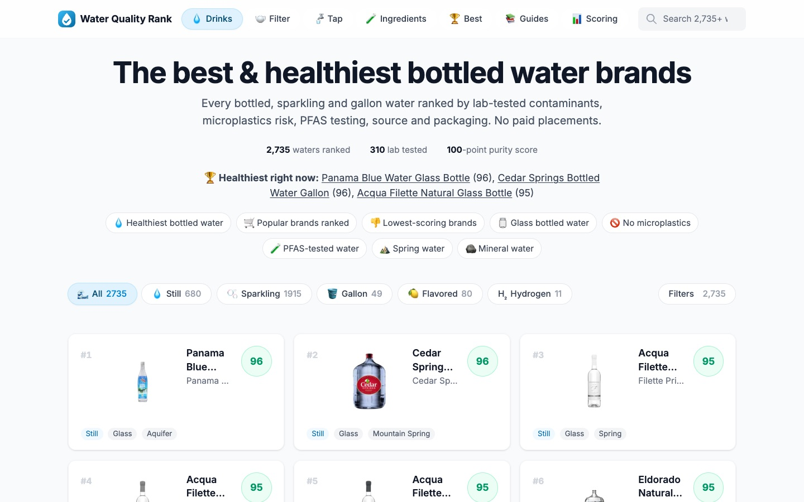

<div align="center">

<a href="https://waterqualityrank.org"></a>

### Which bottled water and filter is actually clean?

[](https://waterqualityrank.org)


**[Open the site](https://waterqualityrank.org)** ·
**[Best bottled water](https://waterqualityrank.org/best)** ·
**[Filters](https://waterqualityrank.org/filter)** ·
**[Tap water](https://waterqualityrank.org/tap-water)** ·
**[How scoring works](https://waterqualityrank.org/scoring)**

</div>

---

A warm, easy-to-browse leaderboard for bottled waters and home water filters, ranked by lab data, source quality,
packaging and contaminant removal. Data comes from [Oasis](https://www.oasishealth.app).

- 💧 **2,700+ bottled waters**: still, sparkling, gallon, flavored and hydrogen, each with a 100-point purity score.
- 🫖 **460+ water filters**: pitchers, reverse osmosis, shower, sink, bottle and whole-home.
- 🧪 **Ingredients**: every contaminant, mineral and PFAS compound with the guideline it's measured against.
- 🚰 **Tap water** for US cities, 🏆 `/best` rankings, ⚖️ brand-vs-brand comparisons and 📚 guides.

## Getting started

```bash
npm install
npm run dev        # local dev server → http://localhost:3000
npm run scrape:oasis   # pull latest Oasis data into data/oasis/latest
npm run build:data     # distill scrape → src/data/*.json
npm run import:oasis:supabase   # archive rich scrape data in Supabase
npm run import:oasis:tap-water  # stream the huge tap-water file into Supabase
npm run build          # production build
npm run check:schema   # JSON-LD vs Google's rules (needs `npm start` running)
```

## Design & tone

**The vibe is warm, clear, and a little playful.** We use emojis on purpose — not as decoration, but as quick visual anchors so anyone (especially older folks who aren't scanning dense UI all day) can tell *what kind of thing* they're looking at before they read the words.

When you add or change UI, keep that energy:

- **Pair every category tab, filter chip, and nav item with an emoji** that matches the meaning at a glance.
- **Keep labels plain English** — "Shower filters", not "shower_filter". Emojis carry the flavor; words carry the facts.
- **Use `aria-hidden="true"` on decorative emojis** so screen readers aren't spammed with "droplet, wrench, shower head…"
- **Fallback emojis** when a product has no image: 💧 for drinks, 🫖 for filters.
- **Don't strip emojis to look "more professional."** The site should feel approachable and trustworthy, not clinical.

### Emoji reference

Keep new UI consistent with what's already in the app.

#### Site & navigation

| Where | Emoji | Meaning |
|-------|-------|---------|
| Logo / favicon | droplet + check (`scripts/brand/logo.svg`) | Water Quality Rank — 🚰 still used in copy |
| Header → Best | 🏆 | `/best` keyword ranking pages |
| Header → Guides | 📚 | `/guides` long-form articles |
| Header → Drinks | 💧 | Bottled & drinkable waters |
| Header → Filter | 🫖 | Home water filter products |
| Header → Scoring | 📊 | How scores are calculated |

#### Drinks leaderboard (`Leaderboard.tsx`)

| Category | Emoji |
|----------|-------|
| All | 🌊 |
| Still | 💧 |
| Sparkling | 🫧 |
| Gallon | 🪣 |
| Flavored | 🍋 |
| Hydrogen | H₂ *(text, not emoji — intentional)* |

#### Drinks ranking filters (`WaterFilters.tsx`, `water-filters.ts`)

| Group / option | Emoji |
|----------------|-------|
| Lab tested only | 🧪 |
| No microplastics | 🚫 |
| Cap safety (section) | 🍾 |
| Low risk cap | ✅ |
| Moderate risk cap | ⚠️ |
| Leaching cap | ☣️ |
| Packaging (section) | 📦 |
| Plastic | 🥤 |
| Glass | 🫙 |
| Cardboard | 📦 |
| Aluminum | 🔩 |
| Aluminum (can) | 🥫 |
| Source (section) | 🏞️ |
| Municipal | 🏙️ |
| Mountain spring | ⛰️ |
| Spring | 💧 |
| Well | 🕳️ |
| Aquifer | 🪨 |
| Iceberg | 🧊 |
| Rain | 🌧️ |
| Unknown | ❓ |

#### Water filters leaderboard (`FilterLeaderboard.tsx`)

| Category | Emoji |
|----------|-------|
| All water filters | 🌊 |
| Shower filters | 🚿 |
| Sink filters | 🚰 |
| Water bottle filters | 🍶 |
| Home filters | 🏠 |

### Selected states & dark mode

Category tabs, filter chips, and header nav use a **soft sky-blue active state** (`src/lib/ui-classes.ts`) — not black pills. Dark mode uses warm blue-slate surfaces (`--surface-page`, `--surface-raised` in `globals.css`) instead of near-black grays.

### Motion & animations

**Never use bottom-to-up entrance animations** — no `translateY` slide-ins, no content rising into view. That effect feels disorienting.

Opacity-only entrance is OK on the home page and elsewhere:

- Page fade on navigation (`template.tsx` → `.page-enter`)
- Hero text stagger (`.page-hero`) — fade only
- Card grid stagger on filter change (`.stagger-grid`) — fade only
- "Show more" items (`.reveal-item`) — fade only
- Search dropdown (`.animate-dropdown`) — fade only

Interaction feedback is fine: button press scale, hover shadow/border/image zoom, collapsible expand, score ring/bar fill. Always respect `prefers-reduced-motion` (see `globals.css`).

Shared classes: `globals.css` (motion tokens + entrance utilities), `src/lib/ui-classes.ts` (press/hover).

### Adding something new?

1. Pick an emoji that a non-technical person would recognize in two seconds.
2. Put it in the same `{ label, emoji }` pattern used in `Leaderboard.tsx`, `FilterLeaderboard.tsx`, or `water-filters.ts`.
3. Update this table if you add a new category or filter group.

## Project layout

```
src/
  app/           # Next.js routes (/, /water/[id], /filter, /filter/[id], /ingredient/[id], /tap-water, /brand, /best, /compare, /guides)
  components/    # Header, Leaderboard, FilterLeaderboard, WaterFilters, …
  data/          # Generated JSON shipped with the site
  lib/           # data loaders, format helpers, filter logic
scripts/
  scrape-oasis.mjs      # Oasis Supabase scrape
  build-site-data.mjs   # Oasis → src/data
  check-structured-data.mjs  # JSON-LD checker (npm run check:schema)
```

## Data

- **Drinks** — bottled, sparkling, gallon, flavored, hydrogen waters from Oasis `items`.
- **Filters** — pitchers, RO, shower, sink, bottle, and whole-home filters from Oasis `water_filters`.
- **Ingredients** — contaminant, mineral, nutrient, risk, benefit, source, and guideline metadata from Oasis ingredient records.
- **Tap water** — stored in Supabase only for now; it is too large to ship in the static frontend bundle.

### How the site uses data

The frontend does **not** query Supabase at runtime right now. It is a static Next.js site that imports generated JSON from `src/data/*.json` through `src/lib/data.ts`.

That means the normal frontend refresh path is:

```bash
npm run scrape:oasis
npm run build:data
npm run images:sync   # before deploying, so new product images exist
npm run build
```

### Images

Product, filter, ingredient and brand images do **not** use Vercel image optimization (it bills per transform and per byte). `scripts/sync-images.mts` converts each source image to 256px and 640px WebP files and uploads them to the Cloudflare R2 bucket `waterqualityrank-images` (AhmetBuilds account), served at `https://img.waterqualityrank.org` with free egress. The custom `next/image` loader in `src/lib/image-loader.ts` maps every source URL to its file (see `src/lib/image-cdn.ts`).

- Run `images:sync` before deploying new data. It needs `CLOUDFLARE_API_TOKEN` with R2 write access, and skips files that already exist.
- Don't open an image URL before its file is uploaded: Cloudflare caches the 404 for about 4 hours.
- Tap-water city photos and Open Graph images still point straight at the Oasis URLs, so they cost nothing on Vercel.

Detail pages (`/water`, `/filter`, `/ingredient`, `/tap-water`) render on first request and are then cached until the next deploy (`generateStaticParams` returns `[]`).

Supabase is the durable raw-data store, not the live app backend yet. It keeps the richer scrape output around for future features, analysis, search, tap-water pages, and any move away from static JSON.

### Supabase archive

Project: `water-brands-data`

Ref: `twqrdjiuqjtgqdbhrxqa`

Dashboard: https://supabase.com/dashboard/project/twqrdjiuqjtgqdbhrxqa

Remote tables are created by migrations in `supabase/migrations/`:

- `20260605085000_create_oasis_store.sql` creates the Oasis archive tables.
- `20260605103000_add_oasis_query_indexes.sql` adds score/name indexes for common lookup paths.

Current verified imported counts:

| Table | Rows |
|---|---:|
| `oasis_items` | 3,439 |
| `oasis_ingredients` | 4,866 |
| `oasis_nutrients` | 10,541 |
| `oasis_item_ingredients` | 21,059 |
| `oasis_item_nutrients` | 23,963 |
| `oasis_water_filters` | 463 |
| `oasis_air_filters` | 66 |
| `oasis_tap_water_locations` | 18,669 |
| `oasis_brands` | 1,815 |
| `oasis_companies` | 1,538 |
| `oasis_categories` | 250 |
| `oasis_labs` | 69 |
| `oasis_materials` | 4,995 |
| `oasis_test_kits` | 38 |

Run the Supabase import after a scrape when you want to refresh the archive:

```bash
WATER_BRANDS_SUPABASE_URL=... \
WATER_BRANDS_SUPABASE_SERVICE_ROLE_KEY=... \
npm run import:oasis:supabase
```

Tap water is a special case because the file is huge. The streaming importer uses the linked Supabase pooler URL plus the DB password from `SUPABASE_DB_PASSWORD` or `/tmp/water-brands-supabase-db-password`:

```bash
npm run import:oasis:tap-water
```

You can point it at a specific file or import only selected IDs:

```bash
OASIS_TAP_WATER_FILE=data/oasis/2026-06-05T03-55-47-924Z/tap_water_locations.json npm run import:oasis:tap-water
OASIS_TAP_WATER_IDS_FILE=/tmp/missing-tap-ids.txt npm run import:oasis:tap-water
```

Raw scrape output lives in `data/oasis/latest/` (gitignored). Run `npm run build:data` after scraping to refresh `src/data/`.

## SEO & AI search

Where search traffic comes from, and where to add more:

- **`/best/[slug]`** — one page per search intent ("healthiest bottled water", "best shower filter"). Defined in `src/lib/rankings.ts`; add an entry to target a new query.
- **`/compare/[a]-vs-[b]`** — brand head-to-heads ("fiji vs evian"), generated from `POPULAR_BRAND_SLUGS` in `src/lib/compare.ts`. Reversed slugs 308 to the canonical one.
- **`/guides/[slug]`** — long-form answers in `src/lib/guides.tsx`. Numbers are computed from the dataset, so they stay true after a data refresh. Bump `CONTENT_UPDATED` in `src/lib/site.ts` when content changes.
- **Structured data** — `src/components/seo.tsx` (FAQPage, ItemList, BreadcrumbList, Article, Product+Review, Organization/WebSite). Scores are editorial, so products use `review`, never `aggregateRating`. `npm run check:schema` checks every page template; see AGENTS.md.
- **AI answer engines** — `/llms.txt` is generated from live data; `robots.ts` and `proxy.ts` explicitly allow GPTBot, ClaudeBot, PerplexityBot, Google-Extended and friends.
- **After deploying**: `npm run indexnow` pings Bing/Yandex (and DuckDuckGo via Bing) with every sitemap URL. Google picks up `/sitemap.xml` via Search Console.
- Optional env vars `NEXT_PUBLIC_GOOGLE_SITE_VERIFICATION` / `NEXT_PUBLIC_BING_SITE_VERIFICATION` add verification meta tags.
